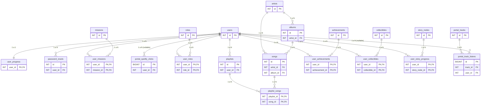

<!-- Archivo: docs/relaciones-bd.md — Propósito: documentar relaciones (FK) entre tablas de btsecho y su intención (core vs proyección). -->
# Relaciones de Base de Datos (btsecho)

Este documento lista **todas las relaciones reales** (foreign keys) existentes en la base de datos `btsecho` y cómo se conectan.

> Nota: varias tablas existen como “proyección futura” (catálogo musical, narrativa, coleccionables). El portal actual usa principalmente auth, misiones, progreso, reset y tracking.

## Diagrama (Mermaid ER)

Si tu visor de Markdown soporta Mermaid, este bloque dibuja el ERD:

## Relación por tabla (FK)

### Base (auth)

- `users` (PK: `id`)
  - Referenciada por: `user_progress`, `password_resets`, `playlists`, `user_roles`, `user_missions`, `user_achievements`, `user_collectibles`, `portal_track_listens`, `portal_spotify_clicks`, `user_story_progress`.

- `user_progress` (PK/FK: `user_id`)
  - `user_progress.user_id → users.id`
  - Tipo: **1 a 1** (un usuario tiene una fila de progreso)

- `password_resets` (PK: `id`)
  - `password_resets.user_id → users.id`
  - Tipo: **1 a N** (un usuario puede pedir varios resets; se controla por `used` y `expires_at`)

### Misiones (gamificación actual)

- `missions` (PK: `id`)
- `user_missions` (PK compuesta: `user_id`, `mission_id`)
  - `user_missions.user_id → users.id`
  - `user_missions.mission_id → missions.id`
  - Tipo: **N a N** entre usuarios y misiones (con atributos extra como `status`, `proof`, `completed_at`)

### Tracking del portal

- `portal_spotify_clicks` (PK: `id`)
  - `portal_spotify_clicks.user_id → users.id` (**nullable**)
  - Tipo: **1 a N** desde usuario (pero permite clics anónimos con `user_id=NULL`)

- `portal_tracks` (PK: `id`)
- `portal_track_listens` (PK: `id`)
  - `portal_track_listens.track_id → portal_tracks.id`
  - `portal_track_listens.user_id → users.id` (**nullable**)
  - Tipo: `portal_tracks (1) → (N) portal_track_listens` y `users (1) → (N) portal_track_listens` (opcional)

### Roles

- `roles` (PK: `id`)
- `user_roles` (PK compuesta: `user_id`, `role_id`)
  - `user_roles.user_id → users.id`
  - `user_roles.role_id → roles.id`
  - Tipo: **N a N** usuarios ↔ roles

### Catálogo musical (proyección)

- `artists` (PK: `id`)
- `albums` (PK: `id`)
  - `albums.artist_id → artists.id` (artists 1 → N albums)
- `songs` (PK: `id`)
  - `songs.artist_id → artists.id` (artists 1 → N songs)
  - `songs.album_id → albums.id` (albums 1 → N songs)

### Playlists (proyección)

- `playlists` (PK: `id`)
  - `playlists.user_id → users.id` (users 1 → N playlists)
- `playlist_songs` (PK compuesta: `playlist_id`, `song_id`)
  - `playlist_songs.playlist_id → playlists.id`
  - `playlist_songs.song_id → songs.id`
  - Tipo: **N a N** playlists ↔ songs

### Logros y coleccionables (proyección)

- `achievements` (PK: `id`)
- `user_achievements` (PK compuesta: `user_id`, `achievement_id`)
  - `user_achievements.user_id → users.id`
  - `user_achievements.achievement_id → achievements.id`

- `collectibles` (PK: `id`)
- `user_collectibles` (PK compuesta: `user_id`, `collectible_id`)
  - `user_collectibles.user_id → users.id`
  - `user_collectibles.collectible_id → collectibles.id`

### Narrativa (proyección)

- `story_nodes` (PK: `id`)
- `user_story_progress` (PK compuesta: `user_id`, `story_node_id`)
  - `user_story_progress.user_id → users.id`
  - `user_story_progress.story_node_id → story_nodes.id`

## Qué tablas son “core” hoy

- Core usadas por el sitio actualmente:
  - `users`, `user_progress`, `missions`, `user_missions`, `password_resets`, `portal_spotify_clicks`
- Proyección / futuras (existen en schema pero no son críticas para el MVP):
  - `roles`, `user_roles`, `artists`, `albums`, `songs`, `playlists`, `playlist_songs`, `portal_tracks`, `portal_track_listens`, `achievements`, `user_achievements`, `collectibles`, `user_collectibles`, `story_nodes`, `user_story_progress`
